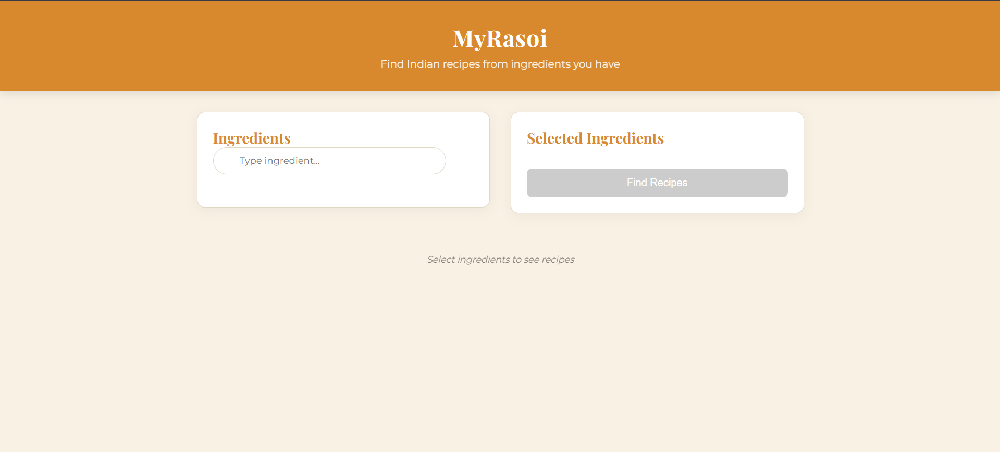
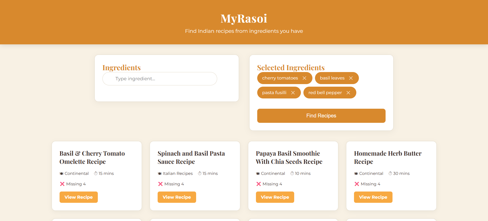

# 🍲 My Rasoi — What's in Your Fridge?

> Suggest Indian recipes based on the ingredients you already have at home.

[](https://myrasoi-lac.vercel.app)


---

## 📖 Overview

**My Rasoi** ("My Kitchen" in Hindi) is a full-stack web application that helps you decide what to cook based on the ingredients sitting in your fridge. Simply select or type in the ingredients you have, and the app will suggest matching Indian recipes — no more staring at the fridge wondering what to make!

The app is powered by a curated **Indian Food Dataset** with normalized ingredients and a recipe-ingredient mapping, so suggestions are relevant and accurate.

---

## ✨ Features

- 🥗 **Ingredient-based recipe suggestions** — Enter what you have and get relevant Indian recipes instantly
- 🍛 **Rich Indian recipe database** — Powered by a cleaned and normalized Indian Food Dataset
- 🔍 **Smart ingredient matching** — Normalized ingredient names ensure better matching across recipes
- 📱 **Responsive UI** — Works seamlessly on desktop and mobile
- ⚡ **Fast and lightweight** — Built with Vite + React for snappy performance

---

## 🖼️ Screenshots


| Home / Ingredient Selector | Recipe Results |
|:-:|:-:|
|  |  |


---

## 🛠️ Tech Stack

| Layer | Technology |
|-------|-----------|
| **Frontend** | React (Vite), CSS |
| **Backend** | Node.js, Express.js |
| **Database** | PostgreSQL |
| **Deployment** | Vercel |

---

## 🗂️ Project Structure

```
my-fridge-food/
├── client/                        # React frontend (Vite)
├── server/                        # Express.js backend
├── Cleaned_Indian_Food_Dataset.csv
├── normalized_ingredients.csv
├── recipe_ingredient_map.csv
├── vite.config.js
├── vercel.json
└── README.md
```

---

## 🚀 Getting Started

### Prerequisites

- [Node.js](https://nodejs.org/) v18+
- [PostgreSQL](https://www.postgresql.org/) installed and running
- npm or yarn

---

### 1. Clone the Repository

```bash
git clone https://github.com/nishtha911/my-fridge-food.git
cd my-fridge-food
```

---

### 2. Set Up the Database

1. Create a PostgreSQL database:
   ```sql
   CREATE DATABASE myrasoi;
   ```
2. Import the data from the CSV files provided in the root of the repo into your PostgreSQL tables. You can use `psql` or a tool like pgAdmin.

---

### 3. Configure Environment Variables

Create a `.env` file inside the `server/` directory:

```env
DB_HOST=localhost
DB_PORT=5432
DB_USER=your_postgres_user
DB_PASSWORD=your_postgres_password
DB_NAME=myrasoi
PORT=5000
```

---

### 4. Install Dependencies & Run

**Backend:**
```bash
cd server
npm install
npm start
```

**Frontend** (in a new terminal):
```bash
cd client
npm install
npm run dev
```

The app will be available at `http://localhost:5173` by default.

---

## 🌐 Deployment

This project is deployed on **Vercel**. The `vercel.json` at the root handles routing configuration for both the frontend and backend.

Live URL: [https://myrasoi-lac.vercel.app](https://myrasoi-lac.vercel.app)

---

## 📊 Dataset

The app uses a cleaned Indian Food Dataset with the following files:

| File | Description |
|------|-------------|
| `Cleaned_Indian_Food_Dataset.csv` | Master recipe dataset with ingredients and metadata |
| `normalized_ingredients.csv` | Normalized ingredient names for consistent matching |
| `recipe_ingredient_map.csv` | Many-to-many mapping between recipes and ingredients |

---

## 🤝 Contributing

Contributions are welcome! To get started:

1. Fork the repository
2. Create a new branch: `git checkout -b feature/your-feature-name`
3. Commit your changes: `git commit -m 'Add some feature'`
4. Push to the branch: `git push origin feature/your-feature-name`
5. Open a Pull Request

---

## 👩‍💻 Author

**Nishtha** — [@nishtha911](https://github.com/nishtha911)

---

